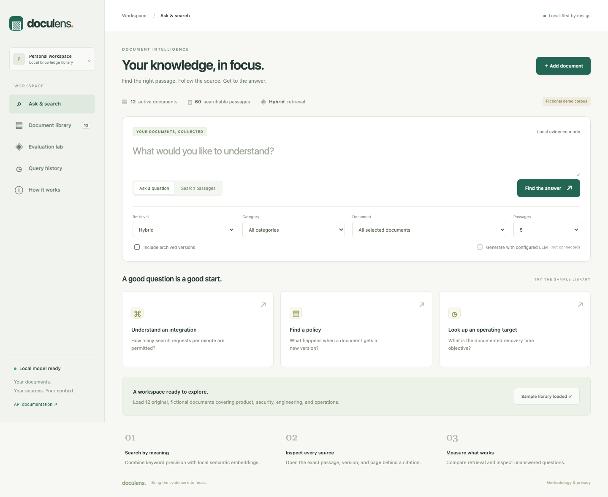

# DocuLens

**A complete local document intelligence and search application.** Upload documents, retrieve relevant passages, inspect citations, compare search methods, and evaluate answers against a reproducible question set.



Built for AI engineering, applied ML, and backend engineering portfolios. The domain is general: product documentation, operating procedures, reports, and knowledge bases.

## Run locally

**Python 3.12 is the tested runtime.** The application requires no Node.js build, LLM API key, AWS account, or external database.

```bash
python3 -m venv .venv
source .venv/bin/activate
# Windows PowerShell: .venv\Scripts\Activate.ps1
python -m pip install -c requirements.lock -e '.[dev,bedrock]'
doculens setup
doculens demo
doculens serve
```

Open **http://127.0.0.1:8010**.

`setup` downloads the pinned local sentence-transformer model once. It downloads model files, not documents, and does not require an account. After setup, ordinary local search and evidence answers load only local model files. PyTorch and the embedding model require disk space and an initial internet connection.

`demo` indexes 12 original fictional documents. You can alternatively start with an empty workspace and click **Load sample library** in the app. The sample describes a fictional Atlas service; its role permissions, limits, prices, and policies are not promises about DocuLens itself.

On subsequent starts, activate your virtual environment and run `doculens serve`. The default SQLite database, model, and local traces persist under `data/`.

To choose another port: `doculens serve --port 8020`.

### Explicit keyword-only mode

If you do not want to download an embedding model:

```bash
DOCULENS_EMBEDDINGS=off doculens demo
DOCULENS_EMBEDDINGS=off doculens serve
```

This uses BM25 keyword retrieval and local excerpts, with semantic/hybrid options disabled. It is not represented as learned semantic search. The standard dependency installation still includes PyTorch; this mode avoids the model download, not the installed Python dependencies.

To enable semantics later, stop the server, run `doculens setup`, then `doculens reindex` with embeddings enabled, and restart. Reindexing updates vectors atomically after all embeddings succeed.

## Implemented capabilities

| Area | Implementation |
|---|---|
| Ingestion | Digital PDF, Markdown, UTF-8 text; strict size/type limits; empty-page warnings |
| Chunking | Section/page-aware 150-word windows with 25-word overlap |
| Embeddings | Pinned `all-MiniLM-L6-v2`, normalized local CPU vectors |
| Retrieval | BM25, exact cosine semantic search, reciprocal-rank hybrid fusion |
| Filters | Category, document, current-only or explicitly included archived versions |
| Answers | Local verbatim evidence by default; optional cited LLM synthesis |
| Citations | Exact chunk, title, version, section/page, original-file download |
| Lifecycle | Immutable versions, atomic replacement, archived search, deletion |
| Evaluation | 66 labeled questions, fixed dev/test split, four retrieval/chunking configurations |
| Traceability | Query timing, ranking scores, model identity, sources, token usage when available |
| Cost estimates | Optional provider-only estimates from actual token counts and user-specified prices |
| Delivery | Responsive UI, FastAPI/OpenAPI, CLI, Docker, CI, tests, documentation |

## Two answer modes

### 1. Local evidence mode — works immediately

The app retrieves passages and selects **verbatim excerpts**. Every displayed citation resolves to an indexed source. No LLM is invoked, and text is not sent to a provider.

This is extractive question answering, not fluent LLM synthesis. Excerpts may be relevant without fully answering the question. A relevance gate can abstain, but it is a heuristic and can miss near-topic unanswerable questions.

### 2. Generated mode — optional provider configuration

Configure an OpenAI-compatible chat-completions endpoint (local or remote), or Amazon Bedrock. The UI enables a checkbox when provider/model configuration exists. A request sends the question and selected passages only when generated mode is selected; the CLI uses `--generate` for the same explicit opt-in.

The generator must return structured statements with allowed source IDs. Unknown/missing citations or a provider failure trigger a clearly labeled fallback to local excerpts. Source-ID validation does **not** prove factual correctness or entailment.

#### OpenAI-compatible endpoint

```bash
export DOCULENS_LLM_PROVIDER=openai-compatible
export DOCULENS_LLM_BASE_URL=http://127.0.0.1:11434/v1
export DOCULENS_LLM_MODEL=YOUR_INSTALLED_MODEL
# Set a key only if the chosen endpoint requires one:
export DOCULENS_LLM_API_KEY=YOUR_KEY
# Optional: set your provider's actual current input/output prices per million tokens.
# export DOCULENS_INPUT_USD_PER_MILLION=...
# export DOCULENS_OUTPUT_USD_PER_MILLION=...
doculens serve
```

The app does not install or start an external/local LLM server. The chosen endpoint must support chat-completions messages and the requested model; endpoint compatibility and structured-output reliability vary.

#### Amazon Bedrock

```bash
export DOCULENS_LLM_PROVIDER=bedrock
export DOCULENS_LLM_MODEL=YOUR_CONVERSE_MODEL_OR_INFERENCE_PROFILE_ID
export AWS_REGION=us-east-1
export AWS_PROFILE=your-profile
doculens serve
```

Install `.[bedrock]` if you omitted it initially. Configure credentials/model access in your AWS account. No cloud resources are provisioned automatically.

Provider-only cost estimates require both actual input/output usage and both configured prices. Missing information is shown as unavailable. Local evidence makes no provider call, so its provider cost is zero; compute, storage, network, and subscriptions are not included. Failed provider requests may still incur charges even if no usage is returned.

## Using the interface

1. **Ask & search:** enter a question, choose retrieval mode and filters, and inspect the answer or passages.
2. **Source inspector:** click a citation or passage title to open the actual evidence and download its original document.
3. **Document library:** upload, preview, replace, or delete a version; show archived versions when needed.
4. **Evaluation lab:** run the sample benchmark and inspect dev/test aggregates and each question's expected evidence.
5. **Query history:** revisit recent questions and export their traces.

The UI preserves filenames, versions, and source labels. User content is rendered as text, not executable HTML. A query trace records the corpus/filter state used at query time; later document changes do not retroactively change an earlier answer.

## Ingest your own documents

```bash
doculens ingest examples/upload-example.pdf --title 'Example operations handbook' --category Operations --version 1.0
doculens ask 'What is the example retention period?' --mode hybrid
```

Supported limits:

- 10 MiB per file, 100 PDF pages, 500,000 extracted characters.
- At most 1,000 chunks per document, 200 document versions, and 10,000 total chunks per workspace.
- Text/Markdown must use UTF-8. Encrypted, empty, and scanned-only PDFs are rejected with a useful message.
- Empty PDF pages are reported; extracted text is not silently described as complete.
- No OCR, DOCX parsing, or guaranteed PDF table/multicolumn reconstruction.
- Long passages can exceed the model's subword-token budget despite word-based chunk limits. The uploader receives a warning; full text remains available to keyword retrieval and citations.

Documents and vectors commit together. Failed replacement leaves the original current version intact. Changing a version label to one already used in the same family is rejected.

### Deletion behavior

Deleting a version removes its document row, raw file, chunks, and vectors from the live database. It also clears stored query traces and evaluation reports because they can contain retained excerpts. Other versions remain; deleting the current version does not automatically reactivate an older one.

This is logical application deletion, not forensic secure erasure of database pages, system backups, browser copies, provider logs, or files already exported elsewhere.

## Evaluation

```bash
doculens evaluate --output data/evaluation.json
```

The benchmark requires all 12 unchanged active sample documents. It excludes user-uploaded content and checks sample hashes before running.

- 66 authored questions: **16 development, 50 test**.
- 54 answerable questions and 12 unanswerable questions overall, including two multi-source questions.
- Keyword/section, semantic/section, hybrid/section, and hybrid/fixed-window comparisons.
- Passage Recall@5, MRR@5, unanswerable abstention, answerable response rate, and latency.
- Answer-term coverage and verbatim quote fidelity are explicitly labeled proxies—not human factual-correctness scores.

[Measured results](docs/EVALUATION.md) and the complete [JSON report](docs/evaluation-results.json) are included. The sample is fictional and labels were authored with the project, not independently reviewed. Do not present the benchmark as production accuracy.

## API

Interactive docs: **http://127.0.0.1:8010/docs**.

```bash
curl http://127.0.0.1:8010/api/status
curl -X POST http://127.0.0.1:8010/api/demo
curl -X POST http://127.0.0.1:8010/api/ask \
  -H 'Content-Type: application/json' \
  -d '{"question":"What is the recovery time objective?","mode":"hybrid","top_k":5}'
curl -X POST http://127.0.0.1:8010/api/documents \
  -F 'file=@examples/upload-example.pdf' -F 'title=Example handbook' -F 'category=Operations' -F 'version=1.0'
```

Main routes: `/api/documents`, `/api/documents/{id}/replace`, `/api/search`, `/api/ask`, `/api/chunks/{id}`, `/api/traces`, `/api/evaluations`.

Evaluation returns `202 Accepted`; poll `/api/evaluations`. Other ingestion/query operations are synchronous and the UI displays pending states. The app serializes corpus mutations and answer creation, which favors consistency over multi-user throughput.

## Docker

```bash
docker compose build
docker compose run --rm app doculens setup
docker compose run --rm app doculens demo
docker compose up
```

Open http://127.0.0.1:8010. The app runs as a non-root user, binds to localhost on the host, and persists the SQLite database/model in a named volume. The image does not embed model weights or secrets.

```bash
docker compose down             # keep workspace data
docker compose down --volumes   # permanently remove this project's stored workspace
```

The provided image is not a production deployment. Docker runtime was not available during this build; see [verification](docs/VERIFICATION.md).

## Tests and development

```bash
pytest -q
ruff check doculens tests
```

Unit/API tests run without downloading the embedding model and do not call remote services. They cover parsing, page attribution, ranking arithmetic, version isolation, deletion, request validation, citation constraints, fallback behavior, and evaluation accounting.

The actual local embedding model was separately exercised by the full benchmark and browser smoke suite.

Optional browser test requires Node.js 20+ and a new disposable workspace:

```bash
npm install
npx playwright install chromium
# Terminal 1: use a fresh folder for each smoke run
doculens --data-dir data/ui-test setup
doculens --data-dir data/ui-test serve --port 8011
# Terminal 2
npm run test:ui
```

The browser script creates and deletes test documents, compares versions, runs the full real-model benchmark, and checks five mobile views. Screenshots go to `data/qa/`.

## Architecture

```text
PDF / Markdown / text
        ↓
Extract + preserve page / section metadata
        ↓
Section-aware chunks → local MiniLM embeddings
        ↓
SQLite document + chunk + vector transaction
        ↓
Metadata filters → BM25 / cosine / reciprocal-rank fusion
        ↓
Evidence gate → excerpts OR explicitly configured LLM
        ↓
Cited answer + source inspector + saved trace
```

Exact cosine search is intentional at this small scale. The app does not claim to use FAISS or a hosted vector database. Moving to an ANN index at larger scale would require consistency/deletion tests and new latency/recall measurements.

## Repository map

```text
doculens/
  api.py            FastAPI routes, input schemas, local UI
  cli.py            Setup, ingestion, queries, evaluation, serving
  config.py         Explicit local/provider settings
  ingest.py         Extraction, validation, page/section chunking
  embeddings.py     Pinned local model download and offline encoding
  store.py          SQLite transactions, lifecycle, traces, evaluations
  retrieval.py      BM25, cosine ranking, reciprocal-rank fusion, gate
  generation.py     Extractive answers, provider adapters, citation validation
  service.py        Ingestion/query orchestration and reindexing
  evaluation.py     Fixed benchmark and inspectable metrics
  sample_corpus/    Original fictional documents and labels
  static/           Browser application and styles
examples/           PDF/text samples for trying ingestion
scripts/            Browser acceptance checks
tests/             Automated tests
docs/              Architecture, evaluation, verification, portfolio guide
```

See [architecture and security boundaries](docs/ARCHITECTURE.md), [methodology](docs/METHODOLOGY.md), and [portfolio/interview guide](docs/PORTFOLIO.md).

MIT-licensed code and original sample corpus. The pretrained embedding model retains its own license and is downloaded separately; see [third-party notices](THIRD_PARTY_NOTICES.md).
