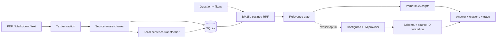

# Architecture and operating boundaries

## Components

The frontend is vanilla JavaScript/CSS served by FastAPI. It needs no Node.js runtime or browser CDN for its core UI. The optional OpenAPI explorer loads its standard documentation resources from a CDN; the actual application works without those resources.

SQLite stores document metadata, original file bytes, chunks, normalized float32 embeddings, traces, and benchmark reports. Vectors are retrieved directly from the live database for each query, so there is no stale independent vector cache to reconcile after replacement or deletion.

## Retrieval scale

The workspace has explicit limits of 200 document versions and 10,000 chunks. At the default 384 dimensions, raw vectors for 10,000 chunks occupy about 15 MB before other database and object overhead. Exact cosine search is a deliberate small-workspace implementation; this project does not claim ANN indexing or large-scale vector-database performance.

BM25 statistics are computed within the filtered candidate set. Therefore changing filters can change scores even for a passage that remains in the candidate set. Scores from different queries, filters, or retrieval modes are not calibrated confidence values.

## Transaction and version rules

- File extraction and embedding complete before document insertion.
- A database transaction commits the original bytes, metadata, chunks, and vectors together.
- Replacement accepts only the current active version and a new family-unique version label.
- The previous version is archived within the same transaction as the replacement insertion.
- A failed replacement rolls back and leaves the previous version current.
- Deletion removes one version, cascades its chunks/vectors, and clears retained query/evaluation records.
- Archived versions remain unless separately deleted. An older version is never silently reactivated.
- Reindex computes every replacement vector before one transactional vector/model-identity update.

The application uses a process-local mutation lock to serialize corpus changes with saved-answer generation and evaluation. It is a **single-process, single-user application**. Do not launch multiple workers/replicas or run CLI mutations concurrently against a live server workspace. Distributed job ownership, a durable queue, and coordinated vector-index transactions would be needed before scaling.

## Model identity

`doculens setup` resolves and stores a pinned model revision under `data/embedding-model/`. Its manifest records model name, revision, dimension, and normalization. Documents carry the embedding fingerprint used at ingestion. Semantic/hybrid queries reject missing or incompatible vectors rather than compare different embedding spaces.

The default model revision is pinned in configuration. To change models, stop the server, move the old embedding-model directory aside, configure the new model/revision, run setup, run reindex, and restart. Setup rejects a conflicting installed model identity instead of silently overwriting it. Keep the old directory until reindex succeeds.

## Query lifecycle

1. Validate bounded question length, retrieval mode, filters, and top-k.
2. Read only eligible chunks; archived versions require an explicit flag.
3. Compute keyword and/or semantic rankings and optional reciprocal-rank fusion.
4. Apply a heuristic relevance gate for answer eligibility.
5. Select verbatim excerpts or call the explicitly configured provider.
6. Validate generated JSON and cited source IDs; fall back visibly on errors.
7. Save a bounded local trace and return an answer with inspectable sources.

The process records retrieval/generation timing and usage returned by a provider. It never assumes that an unavailable usage count is zero. Provider costs are estimates using user-supplied rates; local compute and other fees are excluded.

## Security and privacy boundaries

- Defaults bind to localhost, with no external provider and no outgoing document transfer.
- Model download is a separate setup operation; subsequent evidence requests use local model files.
- The LLM checkbox/CLI flag controls whether selected passages are sent to the configured endpoint.
- Retrieved text is placed in an untrusted evidence payload, not system instructions. The app gives the LLM no execution tools.
- JSON schema/source-ID validation rejects nonexistent references. It is not a proof against hallucination or prompt injection.
- Browser content is escaped/rendered as text. PDF downloads are attachments. Metadata exports guard common spreadsheet-formula prefixes.
- Core UI responses set a content-security policy, no-sniff, and frame restrictions; cross-origin browser writes are rejected.
- SQL uses bound parameters. User filenames never become filesystem paths for original document storage.
- Provider errors are not exposed verbatim to the browser, and request logs omit document/question bodies.

There is no authentication, tenant isolation, production rate limiting, audited secret redaction, malware scanning, OCR sandbox, or forensic secure deletion. Do not expose the service publicly as-is. Provider logging/retention belongs to the chosen provider configuration. Already downloaded/exported text cannot be recalled by deleting a local source.

## Persistence and recovery

The latest 100 query traces are retained locally; the UI lists the latest 30. Evaluation reports persist until document deletion clears them. Startup marks interrupted evaluations failed. Failed uploads do not create a partial searchable document.

SQLite uses foreign keys, WAL mode, and a busy timeout. Back up the database/model directory while the application is stopped or use a SQLite-consistent backup procedure. Copying only the main `.db` file during an active WAL transaction can omit changes.
